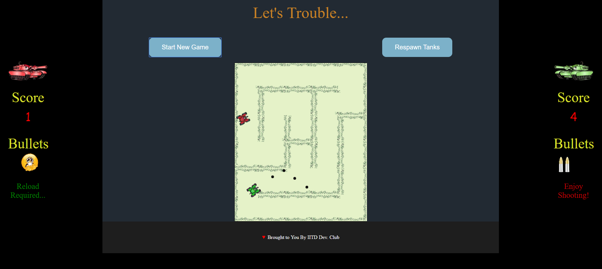

# Tank Assault


> Love solving mazes?
> Or love shooting?


We bring for you an awesome combination of both which will leave you thrilled.<br>
Come and join us.

Compete with your friends or with our awesome A.I.(undefeated till date) (feature coming soon...)



### Visit https://tank-assault.herokuapp.com/  (For outside IIT network)
### Visit http://10.17.51.99:3000/  (On IIT network)

### Controls for 1 Player game: 

| Controls | Keys |
| -------- | ---- |
|Move:| Up & Down arrow key, rotate by left & right arrow key|
|Fire:| F|
|Reload:| R|


### Controls for 2 Player game:

### Player 1 -

| Controls | Keys |
| -------- | ---- |
|Move:| Up & Down arrow key, rotate by left and right arrow key|
|Fire:| Press M|
|Reload:| Press N|

### Player 2 -

| Controls | Keys |
| -------- | ---- |
|Move:| W(up) & S(Down), rotate by A and D
|Fire:| Press X
|Reload:| Press Z

### To run locally

- Install nodeJs on your system
```
    $ git clone https://github.com/devclub-iitd/tankAssault.git
    $ cd tankAssault
    $ npm install
    $ node server.js
    $ visit http://localhost:3000
```
- Select Beat Your Friend mode to play 2 player game
- Select Multiplayer Game mode to play with another player and open another client on other tab

## Authors

* **Atishya Jain** - https://github.com/Atishya-jain
* **Arpan Mangal** - https://github.com/ArpanMangal
* **Ayush Patel** - https://github.com/Ayush21298
* **Arshdeep Singh** - https://github.com/arshsherdill

See also the list of [contributors](https://github.com/devclub-iitd/tankAssault/graphs/contributors) who participated in this project.

### Bugs
- [X] Bullet goes through after hitting
- [ ] Lag on slow networks

### TO DO
- [X] Correct Bullet Problems
- [ ] Reduce the size of JSON Objects sent over network
- [ ] Optimize correct bullet and player speed for good play
- [ ] Implement Prediction Model for reducing lag

**Have Fun :-)**
